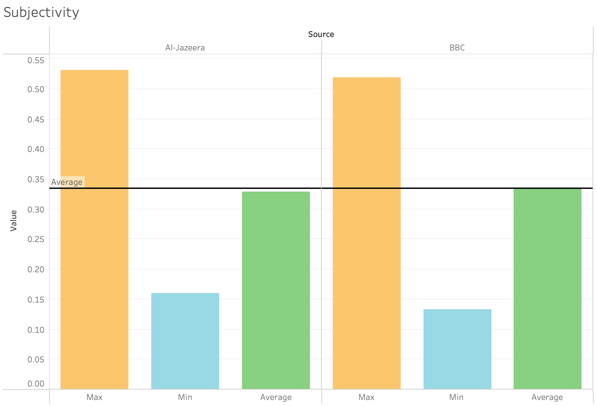
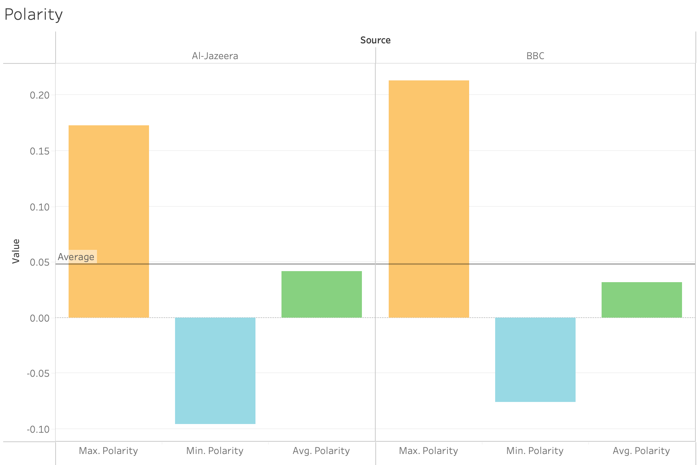
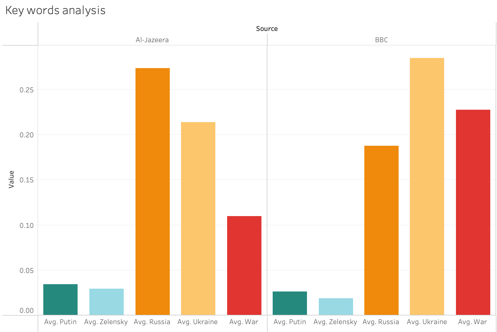

# 🇺🇦 **Ukraine war and media** 🇷🇺

## **1. Facts Context**
After collapsing the URSS and its disolution in 1991, most of the state members got their own identity as countries with their own legislation and political independency; former countries like Latvia, Kazakhstan, Russia or Ukraine became countries with fully rights and recognised in the UN.

Geopolitically talking there had been countries which they decided to ally to 'occidental block' becoming even members of the NATO or EU, like Romania, Estonia, Lithuania etc ([NATO countries](https://www.nato.int/cps/en/natohq/nato_countries.htm)).

Meanwhile, others with more alligned with the former URSS, became support for the russian federation like Belarus, Turkmenistan in between others ([Turkmenistan](https://en.wikipedia.org/wiki/Turkmenistan)).

During this dissolution one of the hardest negotiation was to compound the Ukraine territory; zones like Odesa,which was a main marine base for the URSS, also, was a geostrategic point to connect the old URSS with the rest of the world ([Odesa strategic point](https://www.academia.edu/367981/Strategic_Geopolitical_Significance_of_Odessa)).

For this reason, in 2014 in a context of Maidan protests, started a pro-russian movement as a counterpart of the first one, which ended up declaring "Odesa Autonomous Republic" by the russian federation. After lots of controversies surronding that event, didn't get cleared the responsabilities of what happened, murderers or, if there was some russian influence ([Odesa clashes](https://en.wikipedia.org/wiki/2014_Odesa_clashes)).

Aftermath of Odessa events, other areas of Ukraine like Donetsk scalated on kind of a civil war between the ukranian government and pro-russian independentists concluding on a war in between Russia and Ukraine which continues until the present ([Ukraine war](https://en.wikipedia.org/wiki/2022_Russian_invasion_of_Ukraine)).

## **2. Other ways of war**
On a society of the information and web 2.0. transforming to web 3.0., the world is becoming more interconnected and, like a butterfly effect, the information and, more important, the misinformation is becoming crucial on any conflict. Thus, governments can "manipulate" to get support national and international to get involve on their strategies. 

Example of this was seen during the US presidential election, or, recently, with the Ukraine war: using euphemisms, banning broadcasting corporations like RT in Europe or social networks in Russia are examples of the evolution of "The art of the war of Sun Tzu".

## **3. Analysing BBC and Al-Jazeera**

- **Justification**

BBC is one of the world-wide most known boradcasting corporations. Founded in 1922, became a reference of information in Occident ([BBC](https://www.bbc.co.uk/aboutthebbc/)).

On the other side, Al-Jazeera is the reference on broadcasting, based in Qatar, for information in the arab countries. 

From the geopolitical point of view, BBC, we think it represents the Occident-NATO interests, so, the news they publish would have intention to influence the reader on this scope.

On the other side, Al-Jazeera, we thought it could be the closest approach for "pro-russian" broadcasting because of the influence that Russia had in arabic business([wikipedia](https://en.wikipedia.org/wiki/Russia_and_the_Middle_East)), as, in Europe, since the war started, the main broadcast russian agencies were banned ([EU banned Russian Broadcasting corp](https://www.consilium.europa.eu/en/press/press-releases/2022/03/02/eu-imposes-sanctions-on-state-owned-outlets-rt-russia-today-and-sputnik-s-broadcasting-in-the-eu/)).

- **Methods**

To check the influence of their scopes according to the war, we webscrapped BBC's and Al-Jazeera's websites using Selenium through python.

To do so, we made Selenium to look for ukraine news (clicking to the link corresponding to "Ukraine war" in their main website), store the links and download the content of them on a dataframe (DF, from now onwards).

Once created this first DF, the next step was to extract the information we wanted; in this step we got what we considered "key words" of this topic: war, Ukraine, Russia, Zelensky, Putin; the porpose of it is to check the correlation of using those words according what we expect they "support" in this two block band war: Ukraine or Russia.

Other point, by using sentiment analysis, we wanted to include in this DF the subjectivity and porality applied to the news (as part of misiformation, trying to evoke emotions to the reader instead of basing the news in facts).

The resulting DF had an issue: we counted the key words on each article and store it, but, to be able to ponderate their relevance on each article we had to divide this number by the number of words in each article and multiply per 100 because of the small result, using MySQL.

To visualise the data extracted, we used Tableau, aggregating as required the hypothesis.

- **Results**

After the analysis we found the subjectivity average in between both broadcasting is around 0.32 (on a scale from 0-1), lying on that number the average of subjectivity of BBC vs. Al-Jazeera's which is slightly lower.

Instead we can find that, even having an average subjectivity lower, the most subjective article stands on Al-Jazeera's side, meanwhile, the most objective stays on the BBC's.

Other point analysed is the polarity (on a scale -1 to 1), seeing if there's any sentiment underlying on the news; in this case, the average overall is low (+0.05), getting the most negative point Al-Jazeera and BBC the most positive, having a similar average both(+0.03 aprox.).

Finally, we checked the key words, finding as significant result that Russia is more used in Al-Jazeera vs. Ukraine, and the opposite in BBC. Also significant, the low use of Putin and/or Zelenski as average and the big discrepancy of the use of the word 'war' in between both Broadcasting.

## **4. Conclusions**

The war is a fatal socio-economical event, not just local, even global and within the new paradigm of interconnected society, every imbalance affect the rest of the ecosystem of the society. In this aspect, it's been develope a new kind of war which involves how to influence as many people as possible to obtain the purpose; in this sense, broadcast corporation have an active rol.

We can see that, for example, BBC and Al-Jazeera became part of this "game"; the proper use of a word, the repetition of it, can become fundamental to transmit the idea underlying on a news, or,instead, the opposite, the lack of them, can match with trying to hide some details of a news giving importance to another ones.

In this case, misusing the "main actors's name" could be interpreted as a way to not to create "heroes and villains" war, putting focus in two fronts : Ukraine and Russia. 

Other intereseting point is the difference using the word 'war': Al-Jazeera using it less made us thought they use euphemisms to avoid to use it.

According to the polarity we can see also an average higher use of positive terms in BBC than in Al-Jazeera, which we could infer BBC is trying to provoke higher positive response to the reader, which could repercute on feeling of the possible outcome from the war.

Finally, in subjectivity terms, there's not much discrepancy in between both broadcasting corporations, being slightly lower in Al-Jazeera. It's noted also that in the scale 0-1, the average of both stays around 0.35, which suggests an important influence of the writer's thoughts on the facts shown.

## **5. Disclaimer**

This project is being done with libraries with a specific nomenclator, which, in between the availables, is one of the most reliable. Even that, the accuracy obtained is one of the highest, this means, the possibility of infer in not accurate conclusions ([Accuracy reference](https://neptune.ai/blog/sentiment-analysis-python-textblob-vs-vader-vs-flair)).